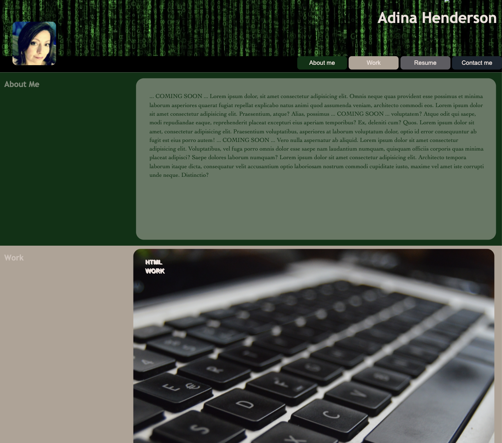
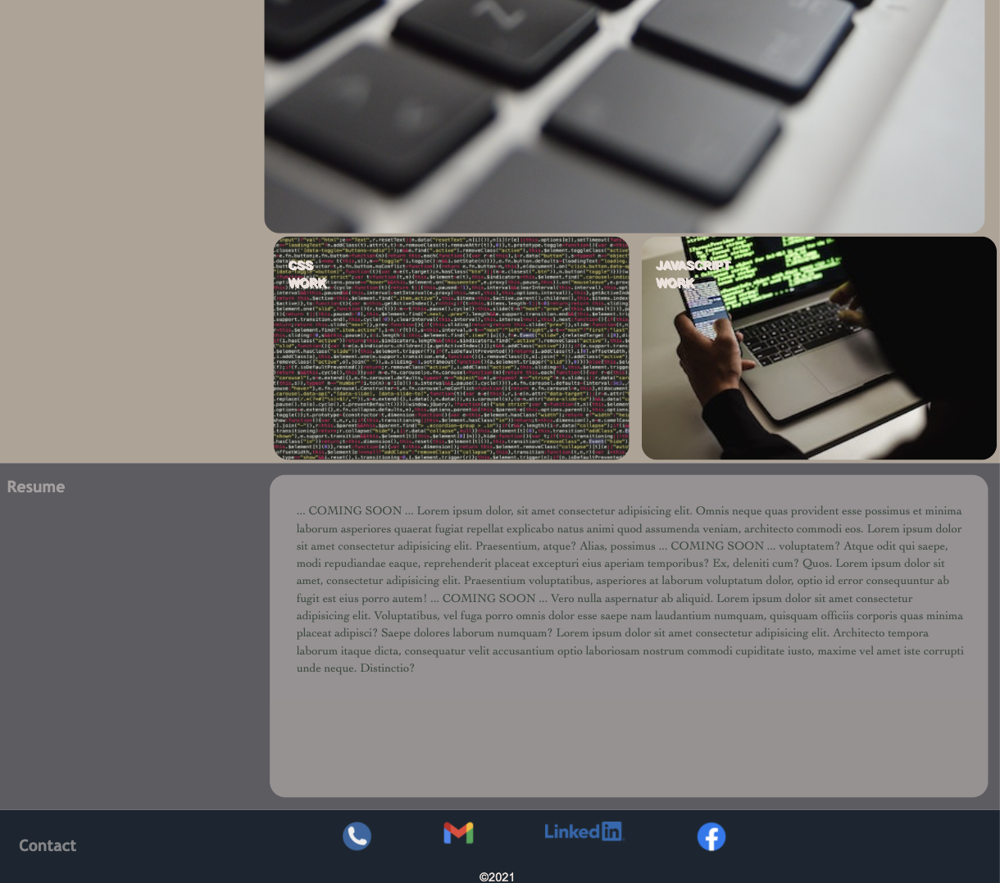

# portfolio-ah

Portfolio exercise

Creation of an online portfolio to be viewed by future employers, this is a work in progress.

This portfolio includes:

Essential elements:

* Developer's name
* Photo
* Links to sections
    ‣ About me
    ‣ Work
    ‣ Contact
* Contact information

Features:

- Dynamic scrolling 
    *UI scrolls to the section with titled images of the developer's applications
- Images included under work section:
    On click, images grow in size as they are presented to the reader
- Responsive layout:
    Content adapts to the page when resized on various screen and devices.

Standards:

- Use of semantic HTML elements

SAMPLE and link to website:

[portfolio link](https://adina-hc.github.io/portfolio-ah/)
[github link](https://github.com/adina-hc/portfolio-ah)